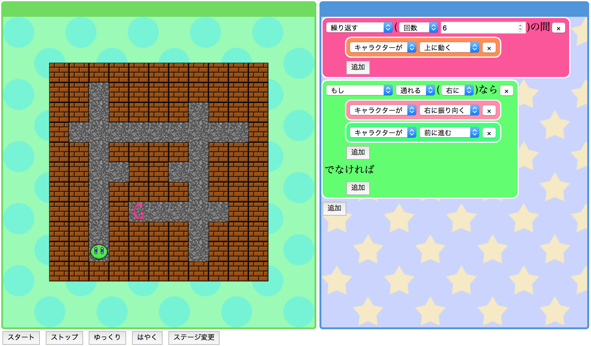

#めいぷろ

めいぷろは子供向けのプログラミング学習教材です。
迷路を解きながら、プログラミングを学ぶことができます。

##機能

めいぷろでは、主に以下の命令を使ってプログラムを作ることができます。

* 移動命令
* 繰り返し命令(while, for)
* 条件分岐命令(if)

##使い方

`src/index.html`をブラウザで開き、好きなステージを選ぶと開始されます。
右側のプログラミングエリアで、プログラムを作って「G」と書かれた場所までキャラクターを移動させることができればクリアです。

##注意

* iPadの画面サイズに最適化されているため、環境によってはレイアウトが崩れます(iPad mini2で動作確認)。
